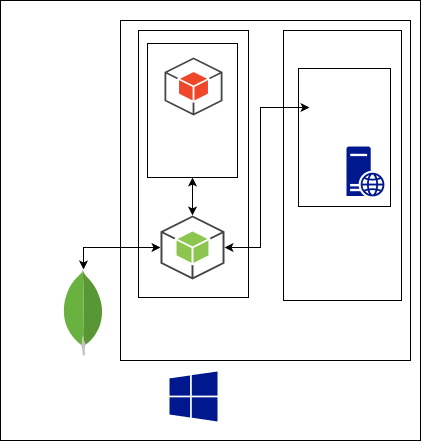

# Overview
- mkdocs
	- https://qiita.com/mebiusbox2/items/a61d42878266af969e3c
- Makefile
- Git,Gthub
- リポジトリ構造
	- https://python-guideja.readthedocs.io/ja/latest/writing/structure.html
- WSL;Windows SUbsystem for Linux
	- シス管系女子 https://system-admin-girl.com/comic/begins/sp-wsl/
	- https://qiita.com/tettsu__/items/85c96850d187e4386c24
	- 海外サーバリポジトリから日本サーバへの切り替え https://qiita.com/Aruneko/items/c79810b0b015bebf30bb
	- 起動時エラー -> Winwdows Update https://va2577.github.io/post/175/
	- ubuntu
		- makeのインストール https://www.yokoweb.net/2018/05/04/ubuntu-18_04-gcc-makme-install/
		- dockerのインストール
			- https://qiita.com/yanoshi/items/dcecbf117d9cbd14af87
			- http://www.nuits.jp/entry/docker-on-wsl
			- docker-cd 17.09.1(docker公式)以降のバージョンはWSLで動かない？ https://qiita.com/guchio/items/3eb0818df44fdbab3d14
			- 最新dokcerを削除して16.04びインストール https://tech.shiroshika.com/windows10-docker/
		- グループの一覧 `cat /etc/group`
		- ユーザにグループを追加する `sudo usermod -aG wheel m-yamagishi`
		- 指定したユーザに変更する `su`
- Docker
	- dockerサービスの起動 `sudo service docker start`
	- dockerのステータス確認 `sudo service docker status` 
	- dockerでmean https://qiita.com/SOhtsu/items/da97e60164669e88a6a7
	- dockerホストとコンテナでバイナリが違う -> scssがビルドできない　https://budougumi0617.github.io/2018/04/04/fail-node-sass-on-docker/
- Junit 4.12
	- 環境設定とコマンドラインでの実行手順 https://github.com/junit-team/junit4/wiki/Getting-started
		- `javac Hello/Main.java`
		- `javac -cp .:junit-4.12.jar:hamcrest-core-1.3.jar Hello/MainTest.java`
		- `java -cp .:junit-4.12.jar:hamcrest-core-1.3.jar org.junit.runner.JUnitCore Hello.MainTest`
- curl
- vscode(javaの実行環境)
- mean
	- mongoDB
	- Express
	- Angular
		- tutorial https://angular.jp/tutorial/toh-pt0

## システム構成

*オンラインジャッジサイトはスクリプトでDockerコマンドを実行するためにLinuxカーネル上でサーブする必要がある*

## 要件一覧
- Windowsのdockerコンテナでubuntuを起動して,ubunutのdockerコンテナでMongoDB,オンラインジャッジを起動する
- オンラインジャッジサイトがAngularで構成できる
- node(Express)で起動下サーバをローカルPC以外からアクセスできる
- DBでユーザを管理できる
	- パスワード
	- ロール
	- 提出状況
	- 出題状況
- ユーザにロールが設定できる
	- 管理者
	- コンテスト参加者
	- 問題作成者
- [x] Javaコードが実行できて,標準出力の結果を表示できる
- 問題作成者がブラウザ上でテストコードを検証し,送信(サーバ側に保存)できる
- Javaコードの標準出力に対してテストが実行できる
- コンテスト(問題)を選択できる
- ソースコードを提出しテストした結果を参照できる
- ユーザの提出したコンテストを一覧で参照できる
- 社内のプログラミングテストで利用できる