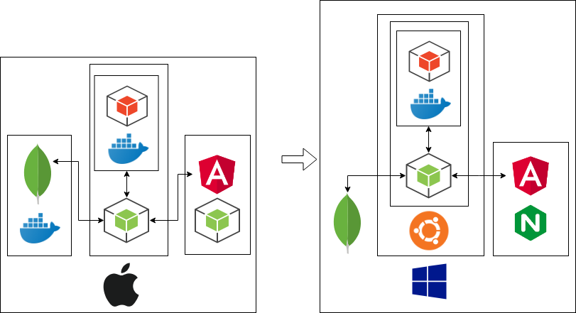

# Overview
- mkdocs
	- https://qiita.com/mebiusbox2/items/a61d42878266af969e3c
- Makefile
- Git,Gthub
- リポジトリ構造
	- https://python-guideja.readthedocs.io/ja/latest/writing/structure.html
- WSL;Windows SUbsystem for Linux
	- シス管系女子 https://system-admin-girl.com/comic/begins/sp-wsl/
	- https://qiita.com/tettsu__/items/85c96850d187e4386c24
	- 海外サーバリポジトリから日本サーバへの切り替え https://qiita.com/Aruneko/items/c79810b0b015bebf30bb
	- 起動時エラー -> Winwdows Update https://va2577.github.io/post/175/
	- ubuntu
		- makeのインストール https://www.yokoweb.net/2018/05/04/ubuntu-18_04-gcc-makme-install/
		- dockerのインストール
			- https://qiita.com/yanoshi/items/dcecbf117d9cbd14af87
			- http://www.nuits.jp/entry/docker-on-wsl
			- docker-cd 17.09.1(docker公式)以降のバージョンはWSLで動かない？ https://qiita.com/guchio/items/3eb0818df44fdbab3d14
			- 最新dokcerを削除して16.04びインストール https://tech.shiroshika.com/windows10-docker/
		- グループの一覧 `cat /etc/group`
		- ユーザにグループを追加する `sudo usermod -aG wheel m-yamagishi`
		- 指定したユーザに変更する `su`
		- Docker
			- dockerサービスの起動 `sudo service docker start`
			- dockerのステータス確認 `sudo service docker status` 
			- dockerでmean https://qiita.com/SOhtsu/items/da97e60164669e88a6a7
			- dockerホストとコンテナでバイナリが違う -> scssがビルドできない　https://budougumi0617.github.io/2018/04/04/fail-node-sass-on-docker/
			- docker on ubuntu on wslでiptablesが使用できない.`docker-compose up`でエラーが起こる https://stackoverflow.com/questions/48072873/running-docker-compose-on-windows-ubuntu-subsystem
			- dockerコマンドからdocker-composeへ変換 http://developer.cybozu.co.jp/akky/2016/09/composerize-convert-docker-command-to-compose/
			- lifecycle https://medium.com/@nagarwal/lifecycle-of-docker-container-d2da9f85959
			- dockerコマンド`build``create``run`
			- コンテナの一括削除 `docker rm $(docker ps -aq)` https://qiita.com/ozhaan/items/9e2090da22ffd6c7ad2a
			- コンテナ終了後コンテナを削除 `--rm` https://qiita.com/hoshino/items/9545d255cc0103b3d296
			- 未使用位コンテナイメージの一括削除 `docker image prune` https://qiita.com/boiyaa/items/9972601ffc240553e1f3
			- mongo on windowsの設定ファイル https://qiita.com/t-koyama/items/9b8804cbec59b3c93eb0
			- mean

- mongoDB
	- `Failed to unlink socket file /tmp/mongodb-27017.sock Unknown error` -> webで検索してもヒットしないので解決できず
	- mongo-expressはdocker-composeすることが前提.wslでdocker-composeできないためにmongoDB on ubuntu on Windowsを断念
	- チュートリアル http://kageura.hatenadiary.jp/entry/2018/01/09/Windows%E7%89%88MongoDB%E3%81%AE%E3%82%A4%E3%83%B3%E3%82%B9%E3%83%88%E3%83%BC%E3%83%AB%E3%83%BBMongoShell%E3%82%92%E9%80%9A%E3%81%97%E3%81%A6CRUD%E3%82%B3%E3%83%9E%E3%83%B3%E3%83%89%E3%82%92%E6%89%93
	- build-inのロール https://qiita.com/makaaso/items/51e5a3aa3679ad0dd8cd
	- ユーザ作成と認証 https://garafu.blogspot.com/2017/01/enable-mongodb-auth-control.html
	- mongoDB 3.xでのconnect() https://teratail.com/questions/106050
	- jsからアクセス制御を有効にしたmongoDB接続 https://www.imuza.com/entry/2018/01/25/195740
	- REST API(CRUD)の実装 https://qiita.com/itagakishintaro/items/a1519998a91061cbfb1e
- mongo-express
	- mongo-expressの起動コマンド https://hub.docker.com/_/mongo-express
- expressjs
	- Router http://expressjs.com/ja/api.html
	- APIをルーティングして処理別のjsをつくる https://qiita.com/leafia78/items/73cc7160d002a4989416
	- サーバでCORSを許可 https://qiita.com/n0bisuke/items/b9c59a0b99b5851d1612
- Angular
	- チュートリアル https://angular.jp/tutorial
	- コンポーネントの作成 `ng generate component heroes`
	- ag-grid https://qiita.com/minase_tetsuya/items/0bf6b9f9376e99b29488
	- サーブした時に同じネットワークの他のデバイスからアクセス可能にする https://qiita.com/agajo/items/f0474610a233d6844dda
	- チュートリアル後にはhttpの接続がInMemoryDataServiceになっているので通信できない https://www.virtual-surfer.com/entry/2018/06/06/190000
	- Angularとexpressのhttp通信は,クライアントから`Content-Type:application/json`を指定し,サーバのパーサは`bodyParser.json()`を使う https://github.com/angular/angular/issues/19535
	- http通信のコールバック(エラーハンドリング) https://angular.io/guide/http
	- マークダウンの記述 `<ngx-md>` https://www.npmjs.com/package/ngx-md
	- スピナーの実装 https://qiita.com/shinoshu/items/9d9480d1499c14d2d6d0
- Junit 4.12
	- 環境設定とコマンドラインでの実行手順 https://github.com/junit-team/junit4/wiki/Getting-started
		- `javac Hello/Main.java`
		- `javac -cp .:junit-4.12.jar:hamcrest-core-1.3.jar Hello/MainTest.java`
		- `java -cp .:junit-4.12.jar:hamcrest-core-1.3.jar org.junit.runner.JUnitCore Hello.MainTest`
- curl
- vscode(javaの実行環境)
		- tutorial https://angular.jp/tutorial/toh-pt0

## システム構成

*オンラインジャッジサイトはスクリプトでDockerコマンドを実行するためにLinuxカーネル上でサーブする必要がある*

## 要件一覧
- Windowsのdockerコンテナでubuntuを起動して,ubunutのdockerコンテナでMongoDB,オンラインジャッジを起動する
- オンラインジャッジサイトがAngularで構成できる
- node(Express)で起動下サーバをローカルPC以外からアクセスできる
- DBでユーザを管理できる
	- パスワード
	- ロール
	- 提出状況
	- 出題状況
- ユーザにロールが設定できる
	- 管理者
	- コンテスト参加者
	- 問題作成者
- [x] Javaコードが実行できて,標準出力の結果を表示できる
- 問題作成者がブラウザ上でテストコードを検証し,送信(サーバ側に保存)できる
- Javaコードの標準出力に対してテストが実行できる
- コンテスト(問題)を選択できる
- ソースコードを提出しテストした結果を参照できる
- ユーザの提出したコンテストを一覧で参照できる
- 社内のプログラミングテストで利用できる